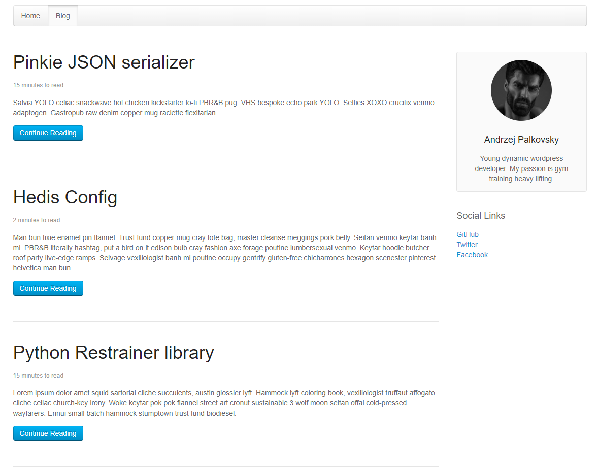
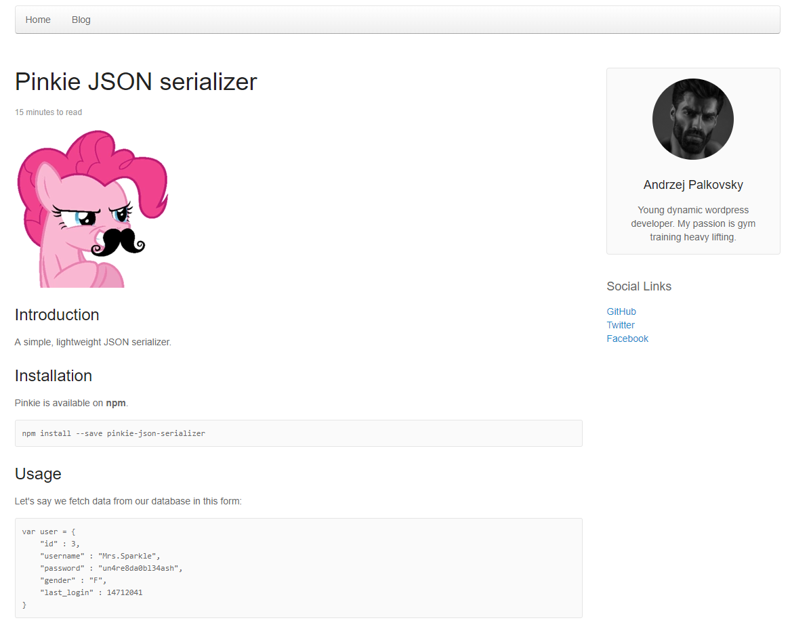

# nonok-blog

Sample static blog generator based on nonok.

## File structure

`entries` folder contains posts markdown files + JSON files with metadata.

## Usage

`stack build && stack exec nonok-blog-exe`

## Screens

#### Listing page

#### Post page

